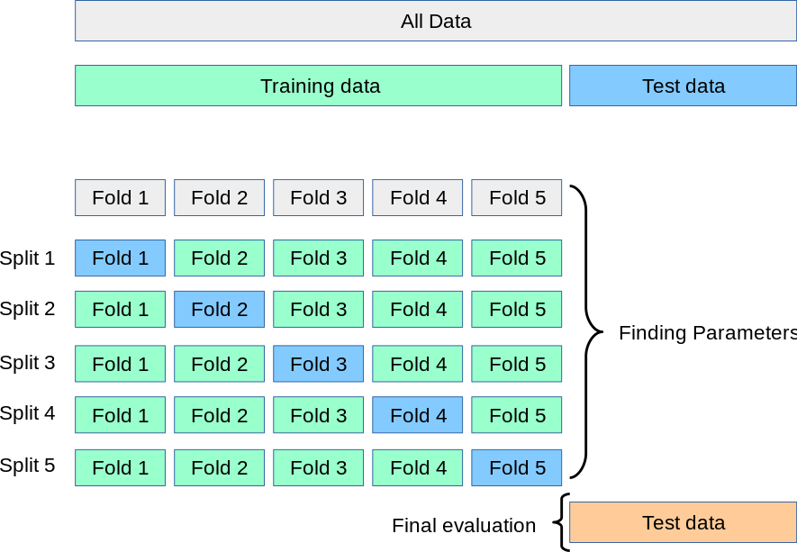

# Predicting-House-Prices-by-Using-Regression-Models
## Supervised Learning: 
Supervised learning is the most common subbranch of machine learning today. Typically, new machine learning practitioners will begin their journey with supervised learning algorithms.

#### How supervised learning works:
Supervised machine learning algorithms are designed to learn by example. The name “supervised” learning originates from the idea that training this type of algorithm is like having a teacher supervise the whole process.
When training a supervised learning algorithm, the training data will consist of inputs paired with the correct outputs. During training, the algorithm will search for patterns in the data that correlate with the desired outputs. After training, a supervised learning algorithm will take in new unseen inputs and will determine which label the new inputs will be classified as based on prior training data. The objective of a supervised learning model is to predict the correct label for newly presented input data. At its most basic form, a supervised learning algorithm can be written simply as:
  **Y=F(X)** 
 
Where Y is the predicted output that is determined by a mapping function that assigns a class to an input value x. The function used to connect input features to a predicted output is created by the machine learning model during training.
Supervised learning uses a training set to teach models to yield the desired output. This training dataset includes inputs and correct outputs, which allow the model to learn over time. The algorithm measures its accuracy through the loss function, adjusting until the error has been sufficiently minimized.
Supervised learning can be separated into two types of problems when data mining classification and regression 
 
## Regression:
Regression is used to understand the relationship between dependent and independent variables. It is commonly used to make projections, such as for sales revenue for a given business. Linear regression, logistical regression, and polynomial regression are popular regression algorithms.

### Simple Linear Regression:
This is one of the most common and interesting type of Regression technique. Here we predict a target variable Y based on the input variable X. A linear relationship should exist between target variable and predictor and so comes the name Linear Regression.
Consider predicting the House Price based on the number of it's bedrooms. We can easily identify that there seems to be a correlation between bedrooms number and house price (more bedrooms, more the house price). The hypothesis of linear regression is
  **Y=a + bX**
 
Y represents house price, X is bedroom number and a and b are the coefficients of the equation. So in order to predict Y (price) given X (bedroom number), we need to know the values of a and b (the model’s coefficients).

### Multiple Linear Regression:
Multiple linear regression (MLR), also known simply as multiple regression, is a statistical technique that uses several explanatory variables to predict the outcome of a response variable. The goal of multiple linear regression is to model the linear relationship between the explanatory (independent) variables and response (dependent) variables. In essence, multiple regression is the extension of ordinary least-squares (OLS) regression because it involves more than one explanatory variable. 
  **Y=a + bX1 + bX2 + bX3 + ...+ bXn**

### Polynomial Regression:
In polynomial regression, we transform the original features into polynomial features of a given degree and then apply Linear Regression on it. Consider the above linear model Y = a+bX is transformed into something like 
  **Y=a + bX +cX^2**

### Random Forest Regression: 
Random forests or random decision forests are an ensemble learning method for classification, regression and other tasks that operates by constructing a multitude of decision trees at training time.Ensemble learning method is a technique that combines predictions from multiple machine learning algorithms to make a more accurate prediction than a single model.
A Random Forest operates by constructing several decision trees during training time and outputting the mean of the classes as the prediction of all the trees. To get a better understanding of the Random Forest algorithm, let’s walk through the steps:

  1.	Pick at random k data points from the training set.
  2.	Build a decision tree associated to these k data points.
  3.	Choose the number N of trees you want to build and repeat steps 1 and 2.
  4.	For a new data point, make each one of your N-tree trees predict the value of y for the data point in question and assign the new data point to the average across all of the predicted y values.

A Random Forest Regression model is powerful and accurate. It usually performs great on many problems, including features with non-linear relationships. Disadvantages, however, include the following: there is no interpretability, overfitting may easily occur, we must choose the number of trees to include in the model.

### Support Vector Regression:
In SVR, we identify a hyperplane with maximum margin such that the maximum number of data points are within that margin. SVRs are almost similar to the SVM classification algorithm. We will discuss the SVM algorithm in detail in my next article.
Instead of minimizing the error rate as in simple linear regression, we try to fit the error within a certain threshold. Our objective in SVR is to basically consider the points that are within the margin. Our best fit line is the hyperplane that has the maximum number of points.

## Pros and Cons of various Machine Learning Regression algorithms: 

***In order to chose the best model for our data we take care of the performance of each model (R2 ) on our data set .***
 
## K-fold Cross-Validation
The k-fold cross-validation procedure is a standard method for estimating the performance of a ML algorithm or configuration on a dataset. Use cross-validation to detect overfitting, failing to generalize a pattern.In the regression model it used to find the best squared by using the optimal hyper parameters.
The performance measure reported by k-fold cross-validation is then the average of the values computed in the loop. This approach can be computationally expensive, but does not waste too much data (as is the case when fixing an arbitrary validation set), which is a major advantage in problems such as inverse inference where the number of samples is very small.

## Dataset Explanation 
This repository contains Python implementation of the supervised learning algorithms devised in the Supervised Learning Algorithms for Predicting House Prices by Using Regression Models.
of the basement ceiling or the proximity to an east-west railroad. But this playground competition's dataset proves that much more influences price negotiations than the number of bedrooms or a white-picket fence.
With 79 explanatory variables describing (almost) every aspect of residential homes in Ames, Iowa, this competition challenges you to predict the final price of each home.

#### Practice Skills
  •	Creative feature engineering 
  •	Advanced regression techniques like random forest and SVR and Linear Regression models
 

